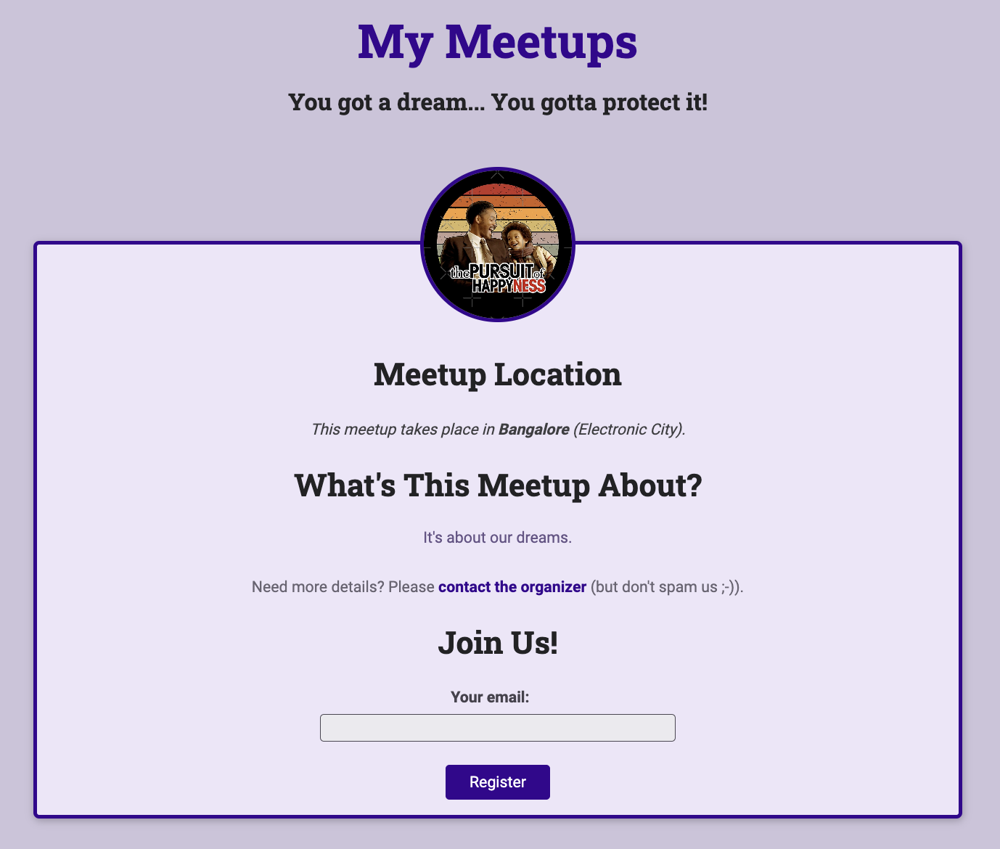
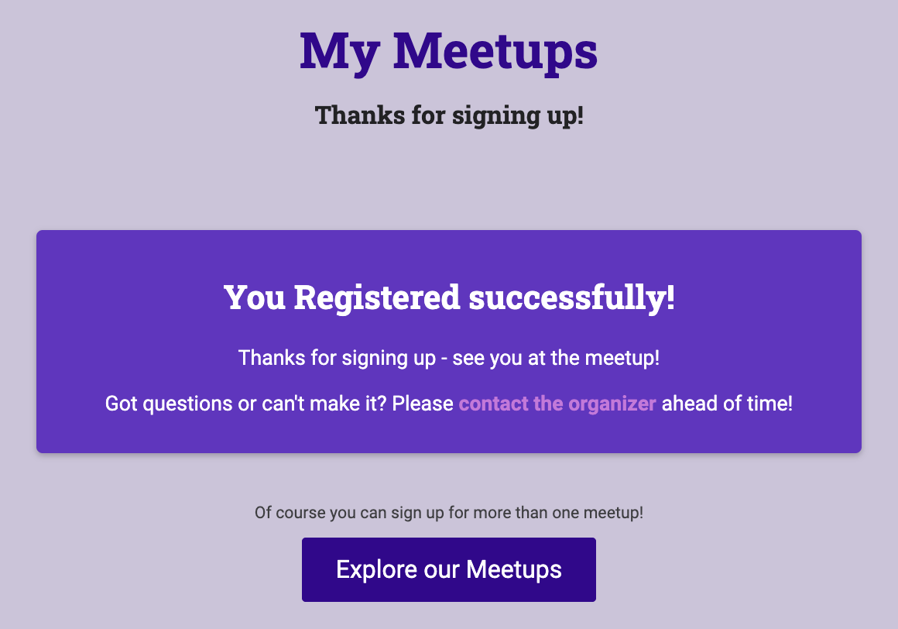

# Meetup

Meetup - a web application.

## Commands

- python manage.py makemigrations
  - Migrations are Django's way of propagating changes you make to your models (adding a field, deleting a model, etc.) into your database schema.
  - They're designed to be mostly automatic, but you'll need to know when to make migrations, when to run them, and the common problems you might run into.
  - migrations are database instructions which are created based on defined models in Django.
- python manage.py migrate
  - Apply migrations so that the database is affected and does change.
- python manage.py createsuperuser
  - Username: admin
  - Email: <admin@email.com>
  - Password: #welcome123
- python manage.py changepassword <user_name>
- python manage.py runserver 5000
- Visit: <http://127.0.0.1:5000/admin/> and <http://127.0.0.1:5000/>

## Notes

### Django

- Django is a Python-based free and open-source web framework that follows the model–template–views architectural pattern.

### Pillow

- Pillow (a fork of PIL)
- Python Imaging Library (PIL) is the de facto image processing package for Python language.
- PIL incorporates lightweight image processing tools that aids in creating, opening, editing, manipulating, and saving images.
- Support for Python Imaging Library (PIL) got discontinued in 2011, but a project named pillow forked the original PIL project and added Python3.x support to it.
- Pillow was announced as a replacement for PIL for future usage.
- Pillow supports a large number of image file formats including BMP, PNG, JPEG, and TIFF. The library encourages adding support for newer formats in the library by creating new file decoders.
- models.ImageField() in django.db is dependent on Pillow python package.

## SQLite

- SQLite is a relational database management system contained in a C library.
- In contrast to many other database management systems, SQLite is not a client–server database engine. Rather, it is a standalone database engine.
- It is embedded into the end program often used for storing embedded SQL-based databases.
- SQLite generally follows PostgreSQL syntax.

## References

- [djongo](https://github.com/nesdis/djongo)
- [Django and MongoDB Connector Design](https://www.djongomapper.com/django-mongodb-connector-design-document/)
- [django-mongodb-engine and djangotoolbox](https://django-mongodb-engine.readthedocs.io/en/latest/index.html)
